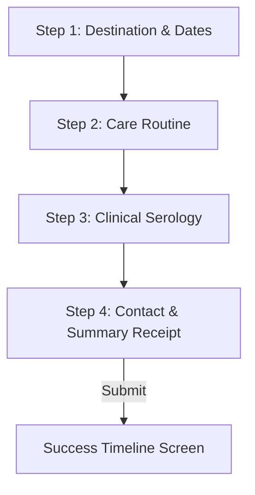
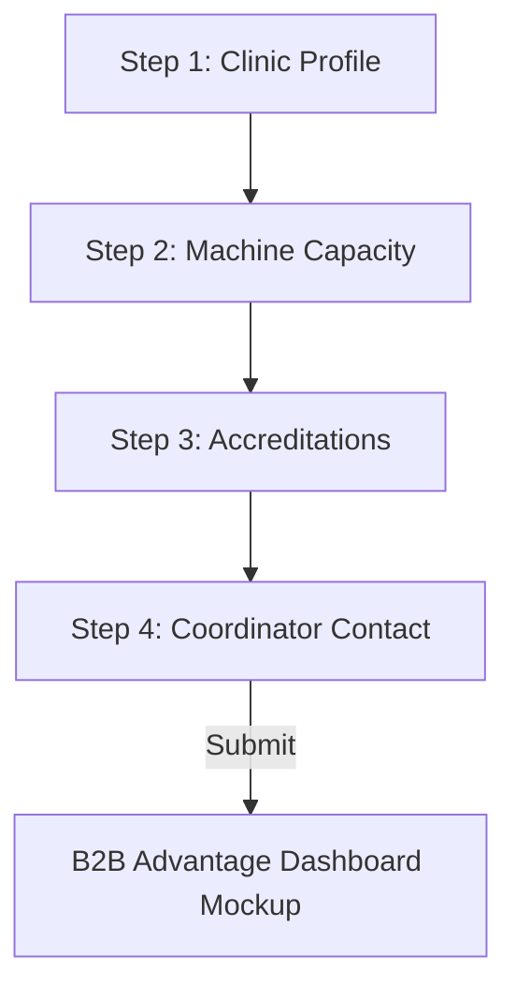

# DialysisOnGo Booking & Partner Funnel

An interactive, multi-step application built for **DialysisOnGo** ([dialysisongo.com](https://dialysisongo.com/)) supporting two separate user flows:
1.  **Patient Booking Flow**: Guides travelers through booking slot requests, preferred shifts, and clinical continuity guidelines (HIV/HBV/HCV viral status safety).
2.  **B2B Clinic Partner Onboarding Flow**: Aligns with the official B2B flyer PDF, guiding dialysis centers through registration, machine inventory, quality badges, and activation of their **5-step Advantage Dashboard**.

---

## 🛠️ Tech Stack & CDNs

This project is built using a clean, vanilla frontend design system requiring zero builders:
*   **HTML5**: Structured semantic panels representing both patient and B2B workflows.
*   **CSS3**: Custom variables styling gold/rose accents, flexible tab buttons, responsive flex rows, and progress step dashboard grids.
*   **JavaScript (ES6+)**: Dual-flow state machine controlling flow toggles (`activeFlow: 'patient' | 'clinic'`), routing validation rules, and dashboard status pipelines.

---

## 🧭 Operational Step Routines

The stepper dynamically toggles icons, titles, and step templates based on the active tab selection.

### Patient Booking Flow (4 Steps)

1.  **Destination**: City and start/end dates.
2.  **Care Details**: Preferred shift grids (Morning, Afternoon, Evening, Night) and weekly session count.
3.  **Clinical Info**: HIV, HBV, HCV toggles and Blood Group selection.
4.  **Confirm**: Review dossier summary and submit contact details.

### B2B Clinic Partner Flow (4 Steps)

1.  **Clinic Profile**: Center Name, City, and full address.
2.  **Machine Capacity**: Total active machines and dedicated isolation slots for viral safety.
3.  **Accreditations**: Toggles for NABH, JCI, and State Board clearances.
4.  **Coordinator**: HOD Manager contact details and B2B validation check.
5.  **Dashboard**: Activates the mock dashboard displaying the **5-Step Advantage Lifecycle**:
    $$\text{Get Inquiries} \rightarrow \text{Booking Received} \rightarrow \text{Confirmed Appointment} \rightarrow \text{Patient's Visit} \rightarrow \text{Session Completed}$$

---

## 🚀 How to Run Locally

Since this is a client-side frontend project, no building or backend server setup is required:
1. Double-click [index.html](file:///c:/Pojects/DialysisOnGo-Funnel/index.html) to open it in any web browser.
2. For testing responsiveness, toggle the inspect element view to mobile sizes.
