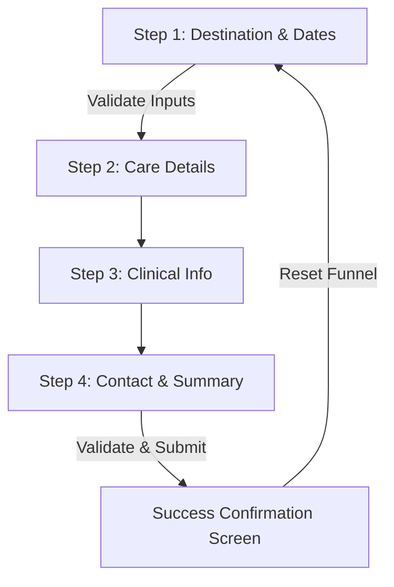

# DialysisOnGo Booking Funnel

An interactive, multi-step booking and patient registration funnel built for **DialysisOnGo**. This application guides clinical travelers through entering their travel plans, custom dialysis routines, and clinical requirements (such as viral marker status) to secure verified dialysis care at their destination.

---

## 🛠️ Tech Stack & Libraries

This project is built following the pure frontend architecture, maximizing performance and responsiveness with zero external dependencies to compile.

### Core Stack
*   **HTML5**: Structured semantically using custom document division classes (Header, Main, Section, Footer) and native input elements (`type="date"`, `type="tel"`, `type="email"`).
*   **CSS3**: Custom design system styled using CSS Custom Properties (Variables) for theming, CSS Grid for shift selection cards, flexbox alignment, and smooth `@keyframes` transitions (`slideIn`, `pulseGlow`, and `heartbeat`).
*   **JavaScript (ES6+)**: Custom state machine implementing step-by-step routing, real-time input validations, responsive state updates, and dynamic summary calculations.

### Third-Party Libraries (CDNs)
*   **Phosphor Icons**: Integrated via unpkg CDN (`@phosphor-icons/web`) to render clinical and travel iconography (heartbeat, location pins, shields, drops, calendars).
*   **Google Fonts**: Links to `Outfit` (used for clean, premium headings) and `Inter` (clinical-grade, highly readable body copy).

---

## 🧭 Funnel Navigation Routine

The booking process is managed as a step-by-step state machine within [app.js](file:///c:/Pojects/DialysisOnGo-Funnel/js/app.js), restricting progress until specific inputs are validated.

### Step 1: Destination & Dates
*   **Inputs**: Destination City, Start Date, and End Date of travel.
*   **Validation**: 
    *   Destination must be provided.
    *   Start date must be selected and in the future.
    *   End date must be selected and must fall after or equal to the start date.
*   **Dynamic Rules**: Selecting a start date automatically updates the `min` attribute of the end date field.

### Step 2: Care Details
*   **Inputs**: Preferred Dialysis Shift (interactive cards), Sessions per Week, and Dialyzer preference.
*   **Interaction**: Click event listeners on cards toggle active visual states and update the underlying memory buffer. No blockages here.

### Step 3: Clinical Information
*   **Inputs**: Viral Marker Status (HIV, HBV, HCV toggles) and Blood Group.
*   **Dynamic Warning**: Choosing a "Positive" marker status displays an alert notification reassuring the patient that isolated machinery will be matched for safety.

### Step 4: Contact & Summary
*   **Inputs**: Patient Name, Phone Number, and Email.
*   **Live Summary**: Compiles all choices from previous steps into a clean digital "Receipt card" for final review before submission.
*   **Validation**: 
    *   Full Name must contain at least 2 characters.
    *   Phone number must contain at least 8 digits.
    *   Email, if provided, must match the email regex standard.

### Success Screen
*   **Feedback**: Initiates a 1.5-second simulated server request showing a loading spinner on the button, then displays a success checkmark animation, a detailed "What happens next?" checklist, and a contact hotline.
*   **Reset**: Clicking "Submit Another Booking" clears form states, resets selected cards, restores default drop-down indices, and returns the stepper to Step 1.

---

## 🚀 How to Run Locally

Since this is a client-side frontend project, no building or backend server setup is required:
1. Double-click [index.html](file:///c:/Pojects/DialysisOnGo-Funnel/index.html) to open it in any web browser.
2. For testing responsiveness, toggle the inspect element view to mobile sizes.
